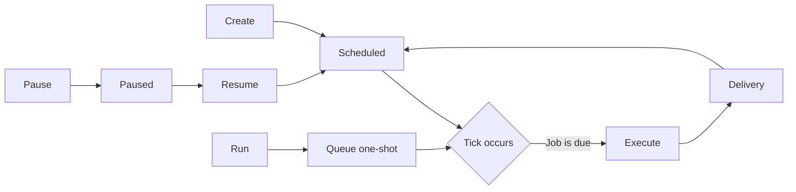

# Hermes Cron Operations

## Architecture — Why Crons Don't Fire in CLI

The cron scheduler's `tick()` function (in `cron/scheduler.py`) is **only called from the gateway process** — specifically from `_start_cron_ticker` in `gateway/run.py`, which spawns a background daemon thread that ticks every 60 seconds. This is by design: the gateway is the long-lived process; CLI sessions are ephemeral.

**Consequence:** When you run `cronjob(action='run')` or schedule a job during a CLI session, the job is queued in the SQLite DB but **never executed** because nothing is calling `tick()` to process due jobs. The job remains in `scheduled` state with no `last_run_at` update.

**Verification:**
```bash
hermes cron status
# ✗ Gateway is not running — cron jobs will NOT fire
#   4 active job(s)
```

## CLI Commands

| Command | Purpose |
|---------|---------|
| `hermes cron list` | List all jobs with schedule, state, model |
| `hermes cron status` | Check gateway status + active job count |
| `hermes cron tick` | One-shot: process all due jobs and exit |
| `hermes cron run <id>` | Queue a one-shot run (fires on next tick) |
| `hermes cron create ...` | Create a new scheduled job |
| `hermes cron edit <id>` | Edit a job's schedule/prompt/skills |
| `hermes cron pause <id>` | Temporarily disable a job |
| `hermes cron resume <id>` | Re-enable a paused job |
| `hermes cron remove <id>` | Permanently delete a job |

## Making Crons Fire Without the Gateway

### Option A: Background Loop (Session-Local)

Start a bash loop in a background terminal that ticks every 60 seconds:

```bash
while true; do hermes cron tick; sleep 60; done
```

**Pros:** Quick, zero config. **Cons:** Dies when the terminal session ends. Use `terminal(background=true)` to run it in the background of your current CLI session.

### Option B: Windows Task Scheduler (Persistent)

Create a scheduled task that runs `hermes cron tick` every minute. Survives reboots — crons fire even when no Hermes session is active.

**Setup:**
1. Find the hermes executable path: `where hermes` or check the Python/Scripts location.
2. Create a task in Task Scheduler:
   - Trigger: Every 1 minute (or every 5 minutes — adjust based on your cron schedules)
   - Action: Start a program → `~/AppData/Local/hermes\AppData\Local\Programs\Python\Python312\python.exe`
   - Arguments: `-m hermes_cli hermes cron tick` (or path to `hermes` script)
   - Start in: `~/AppData/Local/hermes\AppData\Local\hermes`

## Schedule Rationality — Matching Frequency to Cost

Schedules should reflect the **cost profile** of the job and the **rate of meaningful change** in what it monitors. A frequency that makes sense for one job type is wasteful for another.

### Cost Profiles

| Job Type | Cost Per Run | Token Cost Example |
|----------|-------------|-------------------|
| **no_agent script** | Zero | 0 tokens — script runs bare, no LLM |
| **Agent cron (LLM-powered)** | Provider tokens | ~1K–50K input + output tokens per run |

**Implication:** An agent cron running every 2 hours costs **12 LLM calls/day** for task review that changes 2-3x/day. A no_agent script running every 5 minutes costs nothing per run, but still consumes scheduler ticks and delivers output — 288 runs/day is noise if no one reads it.

### Guideline Table

Use these starting points. Adjust when you have evidence the signal changes faster.

| Job Purpose | Type | Suggested Max Frequency | Rationale |
|------------|------|------------------------|-----------|
| **Task curation, review, prioritization** | Agent | Every 6h, preferably daily | Task landscape changes 2-3x/day tops. 6h is aggressive; daily is usually sufficient. |
| **Wiki health / content audits** | Agent | Daily or weekly | Content doesn't degrade in hours. |
| **Code generation / PR review** | Agent | On-demand only (cron is wrong tool) | These shouldn't be scheduled at all. |
| **Internal state sync (DB, registry, identity)** | no_agent | Every 15-30m | 5m polls 288x/day. 15m is 96x/day — still responsive, far less noise. |
| **Backup sync** | no_agent | Every 3-6h | Backups change slowly. Every backup is a full file copy regardless of delta. |
| **Health watchdog (router, fleet, cascade)** | no_agent | Every 5-15m | Silent when healthy — no message cost if output is guarded. Low-frequency would miss outages. |
| **Maintenance (cleanup, disk hygiene)** | no_agent | Daily or weekly | Temporary files accumulate over hours to days, not minutes. |
| **Weekly reports** | no_agent | Weekly (obviously) | — |

### How to Audit

1. **List all jobs** — `cronjob(action='list')` — sort by schedule, not name
2. **Flag anything running more often than once per hour** — these need justification
3. **Separate by type** — agent crons cost tokens, no_agent scripts cost ticks
4. **Check rate of change** — does the underlying data or condition meaningfully change at this frequency? A task list reviewed every 2 hours that updates 2 times per day is 6 wasted runs.
5. **Check for silent-if-idle** — no_agent scripts that always print (even when nothing changed) at 5m intervals produce notification fatigue. Fix the script, don't just slow the cron.
6. **Dial back, wait, observe** — reduce frequency 2-4x. Check `last_status: ok` after 3-5 ticks. If nothing broke, the old frequency was overkill.

### Pitfalls

- **Don't put agent crons on sub-hourly schedules.** Every 2h (12x/day) is almost never worth the token cost. Every 30m (48x/day) is never worth it.
- **"But it's only 1000 tokens!"** — 1000 tokens × 48 runs/day = 48K tokens/day for a single cron. Across multiple agent crons this adds up fast (user runs ~128M tokens/night — every token counts).
- **Silent no_agent scripts aren't free of attention cost.** Even if nothing is delivered, each run takes a scheduler tick, writes a log file, and appears in cron status. Watchdogs at 5m are fine; data syncs at 5m need justification.
- **Consider batch frequency vs burst pattern.** A script that always detects 0 changes in all-but-1-of-288 daily runs should be slowed, not kept at 5m "just in case." Use hourly runs with a manual trigger for exceptions.

## Cron Consolidation &amp; Deduplication

When a cron audit reveals overlapping scripts, you can reduce 18 crons to 15&#43; by identifying and merging **no_agent scripts that scan the same data source on adjacent schedules**.

### Diagnosis — Find the Overlap

1. **List all crons** — `cronjob(action='list')` — scan for scripts that operate on the same directories or data.
2. **Check schedules** — adjacent or same-day schedules on related scripts are consolidation candidates.
3. **Read the scripts** — if two scripts both scan `C:/Hermes-Vault/tracking/entities/` frontmatter, or both clean user temp directories, they belong together.
4. **Check delivery** — same `deliver: local` pattern is another alignment signal.

### Patterns

| Pattern | Candidates | Merge Target |
|---------|-----------|--------------|
| **Same data, different checks** | `stale-task-watchdog` (10am) + `auto-priority` (11am) | Single `daily-task-maintenance` (10:30am) |
| **Same class of cleanup** | `downloads-auto-clean` (Sun 3am) + `desktop-auto-clean` (Sun 3am) | Single `pc-cleanup` (Sun 3am) — both are filesystem temp management |
| **Agent cron absorbs standalone script** | `wiki-health-dashboard` (Mon 6am) + `klio-weekly` (Mon 9am) | Fold health-check steps into `klio-weekly` prompt — same agent, same domain, same day |

### Execution Workflow

1. **Create the merged script** — combine both scripts&#39; logic into one file under `~/.hermes/scripts/`. Use Python (`.py`) for Windows reliability.
2. **Register the new cron** — `cronjob(action='create', ..., no_agent=True, script='merged-script.py', schedule='&lt;optimized time&gt;')`
3. **Remove the old crons** — `cronjob(action='remove', job_id='&lt;id&gt;')` for each replaced job.
4. **If folding into an agent cron** — update the agent cron&#39;s prompt to include the absorbed step (e.g. add &#34;also run wiki lint and stats&#34; to klio-weekly&#39;s instructions).
5. **Verify** — `cronjob(action='run', job_id='&lt;new-id&gt;')` and check `last_status: ok`.

### Pitfalls

- **Don&#39;t merge agent crons (LLM-powered) with no_agent scripts.** An agent cron and a no_agent script that happen to run on the same day are NOT consolidation candidates — one costs tokens and the other doesn&#39;t. Only merge same-type crons.
- **Check for conflicting `workdir`.** A cron with `workdir='C:/Project-A'` cannot merge with one that needs `workdir='C:/Project-B'`.
- **Verify `deliver` routing.** If one job delivers to `all` and another to `local`, merging loses the wider broadcast. Keep separate if delivery targets differ.
- **Update the klio prompt explicitly.** Folding a step into klio-weekly requires editing the cron&#39;s `prompt` field with `cronjob(action='update')`. The klio skill doesn&#39;t auto-inherit the new step — it&#39;s in the cron prompt, not the skill text.

## Script-Based Crons (no_agent)

**Pattern:** Register a standalone shell/Python script as a cron that runs with zero LLM token cost. The script's stdout is delivered verbatim to the user.

**Use case:** Periodic file backups, disk/GPU watchdogs, health pings, API pollers with fixed output shape, any recurring task that doesn't need reasoning.

### Creating a no_agent Cron

1. **Place the script under `~/.hermes/scripts/`** — the cron tool requires relative paths resolved from this directory. Absolute paths are rejected.

2. **Use .py extension** for Windows reliability. Python scripts have no shebang dependency and avoid WSL bash execution issues (see pitfall below). Legacy `.sh`/`.bash` scripts are supported (runs via bash) but may fail on Windows with WSL installed — the cron scheduler can resolve `bash` to WSL's `/bin/bash` instead of git-bash.

3. **Register with the cronjob tool:**
   ```python
   cronjob(
     action='create',
     name='my-backup',
     schedule='every 6h',
     script='my-backup.sh',
     no_agent=True
   )
   ```

**Key characteristics:**
- `prompt` and `skills` are **ignored** when `no_agent=True` — only `script` runs.
- **Empty stdout** = silent run (nothing sent to user) — ideal for watchdogs where "nothing to report" is the good state.
- **Non-zero exit / timeout** = error alert is sent so a broken watchdog can't fail silently.
- **Zero token cost** — no LLM invoked at all.
- Model/provider fields are also ignored.

### Example: File Backup Cron

```bash
#!/bin/bash
# ~/.hermes/scripts/my-backup.sh
set -e
SRC="$HOME/AppData/Local/hermes"
DST="$HOME/OneDrive/backups"
mkdir -p "$DST"
cp "$SRC/config.yaml" "$DST/config.yaml"
echo "Backup complete: $(date)"
```

Registered as:
```python
cronjob(action='create', name='config-backup', schedule='every 6h',
        script='my-backup.sh', no_agent=True)
```

### Watchdog Pattern

Scripts that only output when something is wrong (e.g. disk above 90%, GPU memory low):
- On success/healthy: output nothing → cron runs silently → no message delivered.
- On threshold breach: print the alert → delivered to user.
- On error/crash: auto-alert from non-zero exit.

### Adding Discord Notifications to no_agent Scripts

For scripts that should ping you when something goes wrong (router crash, disk near full, service down), add a Discord webhook notification function:

```bash
# ── Discord alert via webhook ──────────────────────────────────────────
DISCORD_WEBHOOK_URL="https://discord.com/api/webhooks/<id>/<token>"

notify_discord() {
  local level="$1"   # ok, warning, error
  local message="$2"
  local color
  case "$level" in
    ok)      color=3066993;;   # green
    warning) color=15105570;;  # yellow
    error)   color=15158332;;  # red
    *)       color=5814783;;   # blurple default
  esac

  # ⚠️ MSYS/git-bash mangles inline -d "$payload" — MUST use temp file
  local payload_file
  payload_file=$(mktemp /tmp/discord-notify-XXXXXX.json)
  trap 'rm -f "$payload_file"' EXIT
  printf '{"embeds":[{"title":"Script Name","description":"%s","color":%d}]}' \
    "$(echo "$message" | sed 's/"/\\"/g')" "$color" > "$payload_file"

  curl -s -X POST "$DISCORD_WEBHOOK_URL" \
    -H "Content-Type: application/json" \
    -d @"$payload_file" >/dev/null 2>&1 || true
  rm -f "$payload_file" 2>/dev/null || true
  trap - EXIT 2>/dev/null || true
}
```

Then call it at key points in your script:
```bash
notify_discord "warning" "⚠️ Service unhealthy — attempting restart..."
# ... restart logic ...
notify_discord "ok" "✅ Service restarted successfully (PID $PID)"
# ... or on failure ...
notify_discord "error" "❌ Service failed to start"
```

**Key constraint:** The webhook URL is hardcoded in the script (no_agent scripts can't load config). Keep the script local-only. To rotate the URL, edit the script directly.

### Pitfalls
- **Script path must be relative** to `~/.hermes/scripts/` — absolute paths or home-relative paths (`~/path`, `/c/path`) are rejected with a clear error. Copy or symlink your script there first.
- **Workdir**: Use `workdir='~/AppData/Local/hermes/project'` to run the script inside a specific repo directory.
- **One-shot test**: First test with `cronjob(action='run', job_id='<id>')` to verify the script works before waiting for the schedule.
- **⚠️ .sh scripts can fail on Windows with WSL installed.** The cron scheduler resolves `bash` to the system PATH. On Windows with WSL installed, `bash` may resolve to WSL's `/bin/bash` (Linux subsystem) instead of git-bash's `/usr/bin/bash` (Cygwin). WSL bash can't execute scripts with `#!/usr/bin/env bash` because `/usr/bin/env` doesn't exist in the WSL filesystem. The error signature is `execvpe(/bin/bash) failed` in the cron execution log.
  - **Fix:** Convert the script to `.py`. Python scripts have no shebang dependency on Windows — they run directly via `python script.py`. All new no_agent watchdogs on this platform should use `.py` instead of `.sh`.
- **⚠️ No arguments in the script field.** For `no_agent=True`, the `script` field is an exact filesystem path — arguments appended to the script name (e.g. `"session_closeout_audit.py --update --silent-if-clean"`) cause `"Script not found"` at the concatenated path. The scheduler does NOT split into command + args.
  - **Fix:** Create a thin wrapper script in `~/.hermes/scripts/`:
    ```bash
    # ~/.hermes/scripts/my-command-wrapper.sh
    #!/bin/bash
    cd "$(dirname "$0")"
    python my_script.py --flag1 --flag2
    ```
    Then set `script='my-command-wrapper.sh'`.
  - **Detection:** `last_status: error` with `execution_error` containing `"Script not found"` + the full string including args = this root cause. The script file exists; the cron field has args baked in.

### Option C: Start the Gateway

```bash
hermes gateway run
```

**Pros:** The designed solution — cron ticker runs in a background thread. **Cons:** Full messaging stack (Telegram, Discord, etc.) starts even if you don't need it. Spawns a second terminal.

## Common Failure Patterns (Check First)

These are the most frequent cron failures on this platform. Check them in order before deep-diving:

| # | Pattern | Symptom | Root Cause | Fix |
|---|---------|---------|------------|-----|
| 1 | **WSL bash missing** | `execvpe(/bin/bash) failed: No such file or directory` | Cron resolves `bash` to WSL's `/bin/bash` (doesn't exist). Git-bash's `/usr/bin/bash` is on PATH but cron picks WSL first. | Convert `.sh` script to `.py` — Python has no shebang dependency on Windows. All cron scripts on this platform must be `.py`. |
| 2 | **MSYS path mangling** | Script works in git-bash but fails from cron with "no such file" / "table not found" | MSYS translates POSIX paths (`/c/Users/...`) before passing them to native Windows programs. Inside `file://` URIs or `subprocess.run()` the translation produces garbage paths like `C:\\c\\Users\\...`. The `HERMES_HOME` env var is itself MSYS-mangled (`/c/Users/...`). `Path.home()` also returns a Cygwin-aware path, not a raw Win32 path. | **Don't just avoid POSIX paths -- detect and convert them.** Use regex `^/([a-zA-Z])/(.+)` to catch MSYS paths like `/c/Users/...`, then rebuild with temp variables: `_drive = f"{_m.group(1).upper()}:"; _rest = _m.group(2).replace('/', os.sep); result = _drive + os.sep + _rest`. **Python <3.12 trap:** never put `\\\\` inside an f-string -- `f"...:\\\\"` raises SyntaxError. Always build the separator outside the f-string. Prefer `LOCALAPPDATA` env var (always Win32-native) over `Path.home()`. Prefer `USERPROFILE` (also Win32-native) for user home paths. See `references/msys-path-detection-pattern.md` for the full reusable snippet. |
| 3 | **Unpinned agent model** | `HTTP 503: All providers exhausted` | Agent cron jobs (LLM-powered) have no `model`/`provider` pinned. When gateway is down (common), they can't reach any provider. | Always pin `model={'model': 'deepseek/deepseek-v4-flash', 'provider': 'nous'}` on agent cron jobs. This routes via HTTP directly — no gateway dependency. |
| 4 | **Chatty no_agent script** | Script sends a message every run even when nothing changed (Discord spam, notification fatigue) | The script unconditionally prints status output. For watchdogs synced every 5 minutes, this floods the channel. | Guard output behind `if total_changes > 0: print(...)`. Empty stdout = silent run. Design no_agent scripts to be silent when idle by default. |
| 5 | **Wrapper anti-pattern** | A thin wrapper script exists solely to pass arguments to the real script | The real script needs flags (e.g. `--update --silent-if-clean`) but no_agent cron's `script` field doesn't support arguments. | Make the real script default to those flags when called with no args. Then delete the wrapper and point the cron directly at the real script. |

### Diagnosis Procedure

1. **Check `last_status`** — `cronjob(action='list')` — one glance shows all error states
2. **Check `last_delivery_error`** — non-null means the script ran but delivery failed
3. **Check pattern 1 first** — `.sh` scripts on Windows crons are the #1 failure. Convert to `.py`.
4. **Check pattern 3** — agent crons without pinned models fail silently when gateway is down
5. **Run manually** — `cronjob(action='run', job_id='<id>')` resets transient errors; if it succeeds, the error was transient
6. **Run standalone** — `cd ~/AppData/Local/hermes/scripts && python <script>.py` to isolate script issues from cron issues
7. **Add to checklist** — any novel error pattern gets added to this table

## Troubleshooting Failed Crons

### Model Mismatch (HTTP 404)

Most common failure. The cron job references a model that doesn't exist on the configured provider:

```
Model 'nousresearch/hermes-4.3-36b' not found. The requested model does not exist.
```

**Fix:** Update the cron model config:
```python
cronjob(action='update', job_id='<id>',
  model={'model': 'deepseek/deepseek-v4-flash', 'provider': 'nous'})
```

Then verify the new model actually resolves with a direct test:
```bash
hermes chat -q "test connectivity" -Q --model "deepseek/deepseek-v4-flash" --provider nous --yolo
```

**Triple-check cron updates** — The model config change alone is NOT enough. When you migrate a cron from one model/provider to another, update ALL THREE:

1. **Cron model config** — `cronjob(action='update', ..., model=...)`
2. **Cron stored prompt** — The prompt text may contain a self-description like "I run on Hermes 4.3 36B". Strip that line via `cronjob(action='update', ..., prompt='<cleaned>')`.
3. **Reference/template docs** — If an umbrella skill's reference files document the cron prompts (e.g., `references/klio-cron-prompts.md`), update those too so the next agent who recreates the cron doesn't repeat the mistake.

### Transient Error Recovery — `last_status: error` But Script Works Directly

A cron may show `last_status: error` even when the underlying script runs fine when called directly. This happens when the cron scheduler had a transient issue (stale lock file, timing race, WSL/git-bash PATH resolution glitch) during a single tick.

**Batch diagnosis via execute_code:**

When multiple crons show `last_status: error`, test them all in one `execute_code` call instead of one-at-a-time terminal calls. This saves 3+ round trips:

```python
from hermes_tools import terminal

# Test all error-state scripts in parallel
scripts = [
    "session-closeout-wrapper.sh",
    "check-herm-update.sh",
    "sync-hermes-config.sh",
]
for script in scripts:
    path = "~/AppData/Local/hermes/AppData/Local/hermes/scripts/" + script
    result = terminal(command=f'bash "{path}" 2>&1; echo "EXIT: $?"')
    print(f"=== {script} ===")
    print(result.get("output", ""))
```

Then re-trigger each through `cronjob(action='run', job_id='<id>')` to clear the error status.

**Single-cron diagnosis:** The script runs without errors when invoked directly:
```bash
bash ~/AppData/Local/hermes/scripts/<script.sh>  # Works fine
```

But `cronjob(action='list')` shows `last_status: error`.

**Fix — reset the status:** Run the job once through the cron system:
```bash
cronjob(action='run', job_id='<id>')
```

This re-executes the job within the scheduler's error-handling context. If the script runs successfully now, the status flips from `error` to `ok` for the next scheduled tick.

**Pitfall — don't overreact to a single error tick.** If the same cron errors repeatedly (3+ consecutive ticks), investigate the root cause (shebang mismatch, WSL vs git-bash, stale lock). A single `error` status after hours of successful runs is almost always transient — just trigger a manual run and move on.

### Stale `last_run_at: null`

If a cron's `last_run_at` has never been set despite months of operation, the provider is silently failing (API key exhausted, wrong base URL, etc.). The cron was created but never successfully executed.

**Diagnosis:**
```bash
hermes cron list
# Look for: last_run_at: null (never fired) or last_status: error
```

**Check the output directory** for failed run logs:
```bash
ls ~/AppData/Local/hermes/cron/output/<job_id>/
```

### Job Queued But Never Fires

If `cronjob(action='run')` sets a `next_run_at` but it never executes:
1. Check `hermes cron status` — gateway must be running for automatic ticks
2. Run `hermes cron tick` manually to force one tick
3. Check if the job has `enabled: false` or `state: paused`

### Paused Jobs — Mass-Pause Recovery (Resume vs Update)

A batch of jobs paused at the same timestamp (same `paused_at`) likely means they were suspended during a system consolidation and never resumed. Paused jobs drift silently in the DB — `enabled: false`, never firing.

**Resume via dedicated action, NOT update:**
```python
cronjob(action='resume', job_id='<id>')   # ✅ Correct
# NOT: cronjob(action='update', state='resume', ...)  # ❌ Silent no-op
```

The `update` action only changes config fields (schedule, prompt, model, script). Pause/resume are separate state transitions — they require the dedicated `action='resume'` or `action='pause'`.

**Recovery workflow:**
1. `cronjob(action='list')` — identify all paused jobs
2. `cronjob(action='run', job_id='<id>')` — one-shot test before unpausing
3. `cronjob(action='resume', job_id='<id>')` — resume each working job
4. `cronjob(action='run', job_id='<id>')` — verify the resumed job fires

**Prevention:** Check for paused jobs during session startup. Any job paused >24h without a recorded reason should be surfaced to the user.

## Cron Job Lifecycle



- **Scheduled:** Waiting for next due time. Normal state.
- **Paused:** Inactive. Will not fire until resumed.
- **Executing:** A tick picked up this job. Output goes to `cron/output/<job_id>/`.
- **Completed:** One-shot job that has fired its max repeat count. Will not fire again.

## Cron Ticker Daemon (Windows-specific)

The cron ticker is a persistent background process that runs `cron.scheduler.tick()` every 60s. It's needed because the gateway calls `tick()` automatically, but in CLI-only mode the ticker must be started separately.

### Files

| File | Path | Purpose |
|------|------|---------|
| Ticker script | `~/AppData/Local/hermes/scripts/cron-ticker.py` | Python loop calling `cron.scheduler.tick()` every 60s |
| VBS launcher | `~/AppData/Local/hermes/scripts/cron-ticker-launcher.vbs` | Invisible launch via `WScript.Shell.Run` (window style 0) |
| Startup entry | `~/AppData/Roaming/Microsoft/Windows/Start Menu/Programs/Startup/Hermes Cron Ticker.vbs` | Login autostart |

### Ticker script details

- Imports `cron.scheduler.tick()` once, loops every 60s calling `tick(verbose=False)`
- <10MB RAM, 0% CPU between ticks
- File-lock safe (uses same `.tick.lock` as gateway)
- Logs to `~/AppData/Local/hermes/logs/cron-ticker.log`
- Exits on 5 consecutive errors
- Supports `--once` (test), `--interval N`, `--log-dir PATH`

### Commands

```bash
# Test one-shot
cd ~/AppData/Local/hermes/hermes-agent && python ../scripts/cron-ticker.py --once

# Start persistent (manual)
cscript //nologo "~/AppData/Local/hermes\AppData\Local\hermes\scripts\cron-ticker-launcher.vbs"

# Check log
tail -10 ~/AppData/Local/hermes/logs/cron-ticker.log

# Check if running
tasklist //fi "IMAGENAME eq python.exe" //fo list | grep -A1 "PID:" && echo "---" && wmic process where "name='python.exe'" get ProcessId,CommandLine /format:csv | grep cron-ticker

# Stop (find PID first)
tasklist //fi "IMAGENAME eq python.exe" //fi "WINDOWTITLE eq cron-ticker" 2>nul
taskkill //pid <pid> //f
```

### Pitfalls

- The ticker process survives `cscript` exit because `WshShell.Run` creates an independent process
- On Windows, don't use `start /B` or `nohup` — use the VBS launcher pattern
- The ticker runs as the current user, not SYSTEM. Fine for user-level crons
- If you rename/remove the ticker script, the VBS silently fails (checks existence first)
- Debug-level tick logs are suppressed at INFO level — use `--log-level DEBUG` if needed

## Reference Files

- `references/stale-task-watchdog-pattern.md` — Python no_agent watchdog for ADHD-friendly passive monitoring; scans entity frontmatter, flags stale P1/P2 tasks daily
- `references/cron-output-maintenance.md` — Purge old cron output directories; retention policy, auto-purge script, pitfall notes
- `references/common-cron-failure-checklist.md` — Quick-reference checklist of the 6 most common cron failures on this platform. Check these first before deep-diving any cron issue.
- `references/msys-path-detection-pattern.md` — Reusable code snippet for detecting and converting MSYS-mangled POSIX paths to native Win32 paths in cron scripts. Use this in any new `no_agent` script that needs `HERMES_HOME` or user home paths.

## Reference: Key Files & Paths

| Path | Purpose |
|------|---------|
| `cron/scheduler.py` | Core scheduler — `tick()`, `run_job()`, file lock |
| `cron/jobs.py` | Job CRUD — `create_job`, `list_jobs`, `trigger_job` |
| `cron/__init__.py` | Exports: `create_job`, `get_job`, `list_jobs`, `remove_job`, `update_job`, `pause_job`, `resume_job`, `trigger_job`, `tick` |
| `gateway/run.py` (line ~16467) | `_start_cron_ticker` — the only place tick() is called in a loop |
| `hermes_cli/cron.py` | CLI subcommand: `hermes cron tick`, `hermes cron status`, etc. |
| `tools/cronjob_tools.py` | Tool entry point for agent calls |
| `cron/output/<job_id>/` | Per-run output logs named by ISO timestamp |
| `cron/scheduler.db` | SQLite database with job definitions and state |
